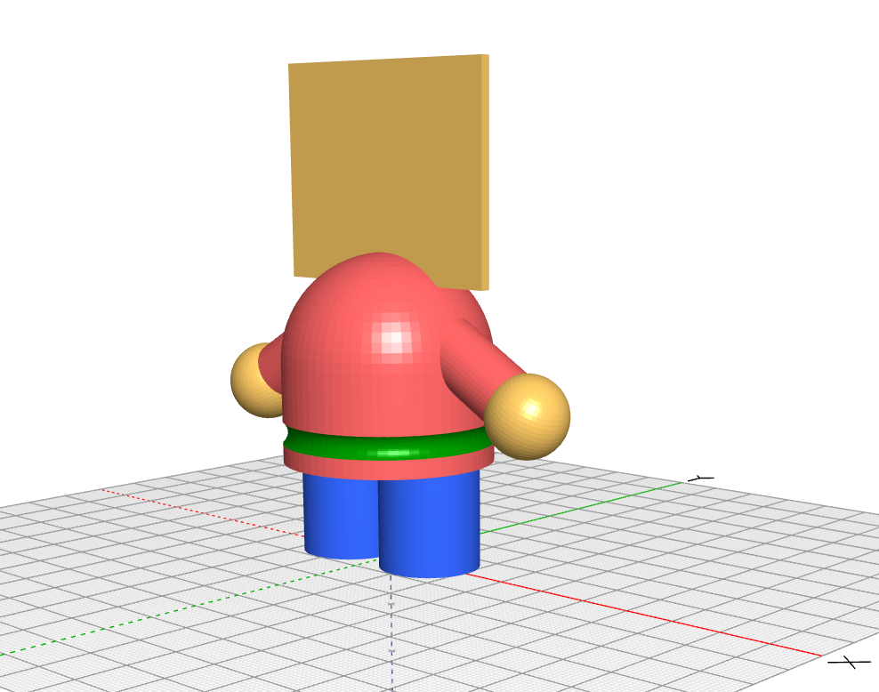

# Modélisation 3D en SI

{width=20% align=left}
L'[impression tridimensionnelle](https://fr.wikipedia.org/wiki/Impression_3D){target=_blank} par dépôt de fil plastique en fusion, FDM (Fused Deposition Modeling), comme le réalise notre imprimantes Simple Metal de marque printrBot, implique la réalisation préalable d'un modèle de la pièce souhaitée avec un logiciel de Conception Assistée par Ordinateur (C.A.O., C.A.D. en anglais).

==Réaliser un modèle 3D, c'est ce que vous allez expérimenter pour vous échapper d'ici...==

Editer [le projet blocksCAD](https://www.blockscad3d.com/community/projects/1537228){target=_blank} en cliquant sur le bouton [:fontawesome-solid-pencil: Edit this project](https://www.blockscad3d.com/editor?project=1537228){ .md-button .md-button--primary target=_blank}

Choisir la langue :fontawesome-solid-globe: `Français` et cliquer alors sur le bouton `Générer un rendu`.

Ordonner les 7 formes 3D (cylindres, cube, sphères et tore) repérées par les lettres a, b, c, l, s, t, v de façon à générer un modèle 3D imprimable tel que :

{.center width=60%}

Vérifier l'ordre des lettres pour obtenir votre code d'échapement