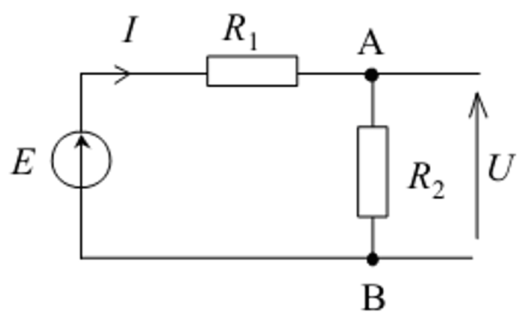

{align=right width=40%}
# Notions d'électricité en SI

Dans notre quotidien, de plus en plus de systèmes fonctionnent grace à de l'énergie électrique.

**Il est donc fondamental pour un ingénieur du XXI^ième^ siècle de maitriser ces notions !**

==Pour constituer votre clé d'échappement, il va vous falloir réussir l'expérience d'électricité suivante :==

***

???+ example "Expérimentation"

    ## Exercice n°1

    <iframe src="../test1_elec.html?embed=true" width="1099" height="333" frameborder="0" allowfullscreen="allowfullscreen"></iframe>

    ## Exercice N°2

    On met à disposition :

    - un multimètre ;
    - quatre piles différentes repérées par les lettres b, c, l, t.

    A l'aide du multimètre en position voltmètre, relever la tension aux bornes de chaque pile.

???- success "Vérification"

    <iframe src="../test2_elec.html?embed=true" width="1399" height="526" frameborder="0" allowfullscreen="allowfullscreen"></iframe>

