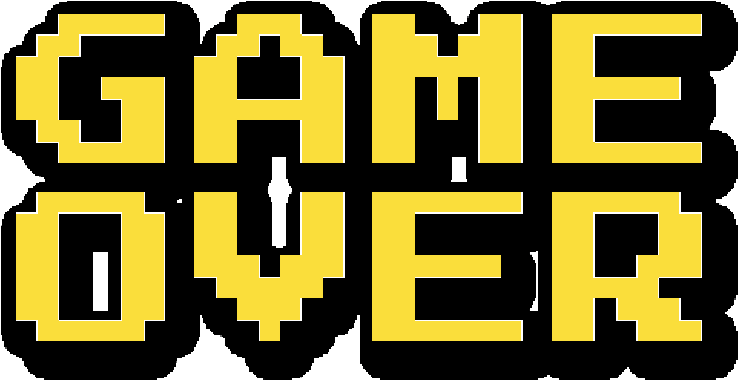
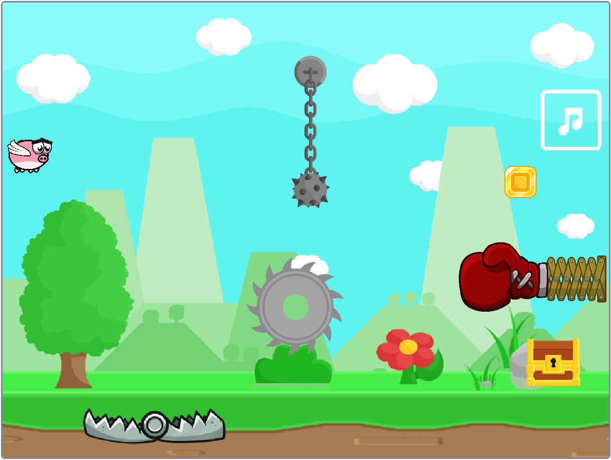
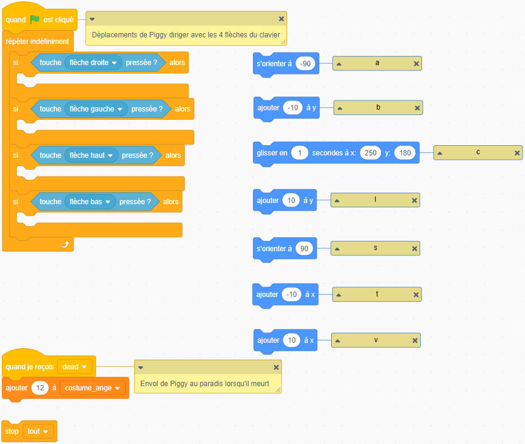

{width=40% align=right}
# Programmation d'un jeu en NSI

En Numérique et Sciences Informatique, les élèves participeront au marathon de programmation de la [Nuit de Code](https://www.nuitducode.net/){target=_blank} en fin d'année : par équipe de deux ou trois, ils auront une soirée de 6h pour programmer un jeu de type retro-gaming en Python.

**Si vous souhaitez y participer, demandez le à vos professeurs car cet évènement est également accessible aux collégiens avec Scratch. Il est cependant nécessaire de s'y entrainer au préalable...** 

==Finaliser la programmation d'un jeu avec Scratch, c'est ce que vous devez expérimenter pour vous échapper d'ici...==

***

???- example "Expérimentation"

    Ouvrir le projet [Trésor de Piggy](https://scratch.mit.edu/projects/809441375/editor/){target=_blank} sur Scratch puis éditer le code de Piggy en cliquant sur son sprite, le cochon ailé qui sera dirigé par le joueur.

    Choisir la langue :fontawesome-solid-globe: `Français`.

    > La règle du jeu à finaliser est simple : Piggy doit récupérer la pièce et l’apporter dans le coffre tout en évitant les obstacles, tous mortels.

    {.center width=60%}

    Placer les 7 blocs de code repérés par les lettres a, b, c, l, s, t, v de façon à programmer les mouvements de Piggy tel que :

    - on utilise les 4 flèches du clavier pour le diriger ;
    - lorsque Piggy est touché par un des obstacles (scie, piège, poing et masse), il meurt et s’envole au paradis avec une auréole sur la tête (et la partie est perdue).      
    
    {.center width=60%}

    === "**Indice n°1**"
        
        - Lorsque l'on clique sur un bloc, le sprite fait l'action correspondante.
    
    === "**Indice n°2**"
        
        - Essayer, c'est en ~~ne~~ faisant ~~pas~~ des erreurs qu'on progresse !
    

???- success "Vérification"

    Glisser/déposer les étiquettes de droite dans les emplacements laissés vides à gauche afin de vérifier votre ordonnancement des blocs de mouvement et ainsi obtenir votre code d'échappement...

    <iframe src="../test_game.html?embed=true" width="1399" height="1171" frameborder="0" allowfullscreen="allowfullscreen"></iframe>

--8<-- "sorties.md"